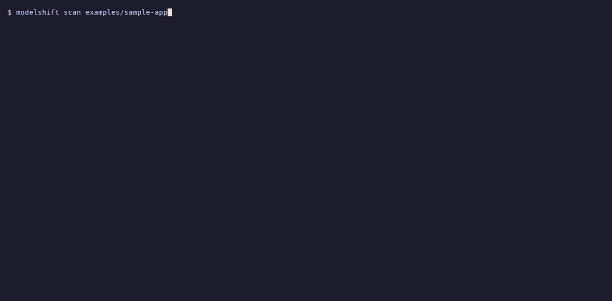

# modelshift

Your model changed. Find out what broke before your users do.



`modelshift` finds every model ID in your repo that retires soon, replays your real prompts on the replacement, and opens the migration PR. A scan of four popular, unrelated open-source repositories found 131 distinct model IDs that are retiring or already retired within 90 days, referenced 1,649 times across 296 files.[^1] The bundled registry separately lists 26 model IDs with a provider shutdown date inside the next 90 days, including the 11 OpenAI snapshots that stop working on 2026-10-23.[^2]

[](https://github.com/Arthur031221/modelshift/actions/workflows/ci.yml)
[](LICENSE)
[](https://www.npmjs.com/package/modelshift)


## Why

Providers retire models on a schedule and most codebases find out when requests start returning 404. OpenAI shuts down `gpt-4-0613`, `gpt-4-turbo`, `gpt-4o-2024-05-13`, `o1`, `o3-mini`, `o4-mini` and five more on 2026-10-23, then the GPT-5 and o3 snapshots on 2026-12-11. Anthropic's Sonnet 4.5 became eligible for retirement on 2026-09-29, Haiku 4.5 follows on 2026-10-15 and Opus 4.5 on 2026-11-24. Claude Opus 4.7 and later reject `temperature`, `top_p` and `top_k` with a 400.

Swapping the string is the easy part. The hard part is knowing whether the replacement still returns valid JSON, still calls your tools with the same arguments, refuses more often, or doubles your latency. modelshift answers both questions from the terminal.

## Install

Not on the npm registry yet, see the roadmap. Two ways to run it today:

```
npx github:Arthur031221/modelshift scan
```

or install it on your `PATH`:

```
git clone https://github.com/Arthur031221/modelshift
cd modelshift
npm install -g .
```

Both build the CLI automatically (the `prepare` script runs `tsup`). Node 20 or newer. No API keys are needed for `scan`, `check`, `fix` and `registry`. `replay` talks to whichever endpoint you point it at, including a local Ollama server.

## Quick start

Run these from inside the clone the first time, they point at the bundled `examples/sample-app` and `demo/prompts.jsonl` so you see real output in under a minute. Point them at your own repo and prompt file afterward.

```
# 1. What retires, where, and what replaces it (exit code 1 when something retires within 90 days)
modelshift scan examples/sample-app

# 2. Does the replacement behave the same? Runs six prompts on two local models and writes modelshift-report.html
modelshift replay --from qwen3:1.7b --to qwen3:4b --prompts demo/prompts.jsonl --no-think

# 3. Rewrite the IDs, drop rejected parameters, print the diff. Add --write to apply, --pr to open a pull request.
modelshift fix examples/sample-app
```

`scan` output for the sample app in this repo:

```
FILE            MODEL                                    PROVIDER   STATUS                                    REPLACEMENT                  SOURCE
app.py:21       claude-3-5-sonnet-20241022               anthropic  retired 2025-10-28                        claude-sonnet-4-6            platform.claude.com/docs/en/about-claude/model-deprecations
config.yaml:3   claude-3-haiku-20240307                  anthropic  retired 2026-04-20                        claude-haiku-4-5-20251001    platform.claude.com/docs/en/about-claude/model-deprecations
.env.example:2  claude-opus-4-1                          anthropic  retired 2026-08-05                        claude-opus-4-8              platform.claude.com/docs/en/about-claude/model-deprecations
config.yaml:2   gemini-2.0-flash                         google     retired 2026-06-01                        gemini-3.6-flash             ai.google.dev/gemini-api/docs/deprecations
config.yaml:6   anthropic.claude-sonnet-4-20250514-v1:0  bedrock    retiring in 14 days (2026-10-14)          anthropic.claude-sonnet-4-6  docs.aws.amazon.com/bedrock/latest/userguide/model-lifecycle-legacy.html
app.py:12       gpt-4o-2024-05-13                        openai     retiring in 23 days (2026-10-23)          gpt-5.6-sol                  developers.openai.com/api/docs/deprecations
router.ts:2     gpt-4.1-nano                             openai     retiring in 23 days (2026-10-23)          gpt-5.6-luna                 developers.openai.com/api/docs/deprecations
router.ts:3     o3-mini                                  openai     retiring in 23 days (2026-10-23)          gpt-5.6-sol                  developers.openai.com/api/docs/deprecations
.env.example:1  gpt-4-turbo                              openai     retiring in 23 days (2026-10-23)          gpt-5.6-sol                  developers.openai.com/api/docs/deprecations
router.ts:4     claude-sonnet-4-5                         anthropic  eligible for retirement since 2026-09-29                               platform.claude.com/docs/en/about-claude/model-deprecations
```

`replay` output for the same six-prompt set against a local Ollama server, `qwen3:1.7b` to `qwen3:4b`, `--no-think`:

```
PROMPT         JSON     REFUSAL  TOOL CALLS  LENGTH  LATENCY MS      SIM  RESULT
json-extract   ok > ok  no > no  - > -         +15%  82213 > 4744   1.00  ok
json-list      ok > ok  no > no  - > -       +1730%  1421 > 29112   0.36  low similarity
summary        - > -    no > no  - > -        +670%  3793 > 44812   0.57  ok
tool-weather   - > -    no > no  1 > 0            -  1504 > 42399   0.00  tool shape changed, no tool call, low similarity
code           - > -    no > no  - > -       +1362%  2292 > 41977   0.39  low similarity
refusal-probe  - > -    no > no  - > -         +50%  19786 > 43767  0.53  ok

Aggregate (from > to)
  errors          0 > 0
  refusals        0 > 0
  valid JSON      2/2 > 2/2
  tool calls      1/1 > 0/1, shape changed on 1
  mean length     363 > 1531 chars (+765%)
  mean latency    18502 > 34469 ms
  cost            $0 > $0 (local models)
  similarity      0.474 mean, lexical cosine (term frequencies)
  regressions     3 of 6 prompts
```

On this machine `qwen3:1.7b` called the `get_weather` tool through Ollama's native API and `qwen3:4b` answered in prose instead, which is exactly the kind of regression `replay` exists to catch before it reaches production. `json-extract` and `json-list` stayed valid JSON on both models. Latency is not comparable to a dedicated inference box, this ran on a shared laptop with other processes competing for the GPU.


## How it works

**scan** walks the tree, honours every `.gitignore`, skips `node_modules`, lock files and binaries, and reads `.py .ts .tsx .js .jsx .mjs .cjs .go .rb .java .kt .kts .cs .yaml .yml .toml .json .env .md .txt`. A set of family regexes finds candidate identifiers (`gpt-4o-2024-05-13`, `claude-sonnet-4-5`, `models/gemini-2.0-flash`, `us.anthropic.claude-...-v1:0`, `qwen3:4b`). Short forms such as `o1` only match inside quotes. Each candidate is looked up in `registry/lifecycle.json` by ID or alias, with vendor prefixes (`openai/`, `models/`) and Bedrock region prefixes stripped. Status is computed against today's date:

| Status | Meaning |
|---|---|
| retired | The shutdown date has passed. Requests fail. |
| retiring | Shutdown inside the window (`--days`, default 90). |
| deprecated | Shutdown scheduled beyond the window, or deprecated without a date. |
| eligible | The provider's earliest possible retirement date is inside the window. No retirement announced yet. |
| active | Known model, nothing scheduled. |
| unknown | Looks like a model ID but is not in the registry. |

**The registry** was seeded on 2026-09-29 by reading the OpenAI deprecations page, the Anthropic model deprecations page, the Gemini API deprecations page and changelog, and the Bedrock legacy lifecycle page. Every entry carries the URL it came from. Dates that could not be read from a provider page are listed in `registry/UNVERIFIED.md` and left out. A weekly GitHub Action re-fetches the pages and opens a pull request when something changed.

**replay** loads a JSONL prompt set, runs every prompt on the source model, then every prompt on the target model (all of one model first, so local servers do not reload weights between calls), and reports per prompt: JSON validity when `"expect":"json"` is set, output length delta, refusal (provider stop reason or a phrase classifier), tool call shape when `tools` are given (names, argument JSON validity, missing required keys), latency, cost from `registry/prices.json`, and similarity. Similarity is a lexical cosine over term frequencies by default, or an embedding cosine with `--embed-model`. A static `modelshift-report.html` shows every prompt with both outputs.

**fix** rewrites identifiers with status retired, retiring or deprecated to the provider's recommended replacement, following chains when the replacement itself retired (`chatgpt-4o-latest` to `gpt-5.1-chat-latest` to `gpt-5.6-sol`). Around any line that names a Claude model from Opus 4.7 onward it removes `temperature`, `top_p` and `top_k`, because Anthropic returns a 400 for non-default values on those models ([API parameter deprecations](https://platform.claude.com/docs/en/about-claude/model-deprecations#api-parameter-deprecations)). Prompt text such as "think step by step" in files that use Claude is flagged, not edited, with a pointer to Anthropic's [prompting best practices](https://platform.claude.com/docs/en/build-with-claude/prompt-engineering/claude-prompting-best-practices), which recommends general instructions over prescriptive steps on thinking models. Everything is a dry run until `--write`.

## Comparison

| Project | Scans code | Lifecycle registry | Replays prompts on the replacement | Rewrites code | CI check |
|---|---|---|---|---|---|
| modelshift | yes, 20 file types | OpenAI, Anthropic, Gemini, Bedrock, sourced and refreshed weekly | yes, JSON, tools, refusals, latency, cost, similarity | yes, with a diff and a PR | yes, action.yml |
| [openai/completions-responses-migration-pack](https://github.com/openai/completions-responses-migration-pack) | one migration (Completions to Responses) | no | no | partial, OpenAI only | no |
| [LiteLLM](https://github.com/BerriAI/litellm) | no | model list with prices, no retirement dates | no, routes and falls back at runtime | no | no |
| [promptfoo](https://github.com/promptfoo/promptfoo) | no | no | yes, general purpose evals with many graders | no | yes, for evals |
| techdevsynergy/llm-model-deprecation, Ort0x36/deprecation-desk, modelrot, llm-deprecation-check | yes, scanner or lint only | small, hand maintained | no | no | some |
| quora/model-deprecation-tracker | no | data only | no | no | no |

promptfoo is the better tool when you want to build a graded eval suite. modelshift is the tool for the afternoon when a retirement email arrives and you need to know what is affected and whether the swap is safe.

## Command reference

Every command accepts `--json` and `--help`.

### scan [path]

| Flag | Default | Meaning |
|---|---|---|
| `--days <n>` | 90 | Window for "retiring" |
| `--known-only` | off | Hide unknown identifiers |
| `--no-gitignore` | off | Ignore `.gitignore` files |
| `--registry <file>` | bundled | Alternative `lifecycle.json` |
| `--today <date>` | today | Evaluate as of an ISO date |

Exit codes: 0 clean, 1 something retired or retiring, 2 usage error. Add `# modelshift:ignore` to a line to skip it.

### check [path]

Same as `scan` but prints only failing findings, emits GitHub Actions annotations when `GITHUB_ACTIONS` is set, and exits 1 on failure. `--fail-on retired,retiring,deprecated,eligible,unknown` sets the policy (default `retired,retiring`).

```yaml
- uses: Arthur031221/modelshift@v0.1.0
  with:
    days: 60
```

The action is a composite that runs `npx --yes github:Arthur031221/modelshift#<version> check`, since modelshift is not on the npm registry yet. A copy of a full workflow is in `examples/workflows/modelshift-check.yml`.

### replay

`modelshift replay --from <model> --to <model> (--prompts <file.jsonl> | --from-sessions)`

| Flag | Meaning |
|---|---|
| `--prompts <file>` | JSONL. Each line: `{"id","prompt"` or `"messages","system","tools","expect":"json","max_tokens","temperature"}` |
| `--from-sessions` | Sample real user turns from `~/.claude/projects/**/*.jsonl` and `~/.codex/sessions/**/*.jsonl` |
| `--n`, `--seed`, `--out`, `--sample-only`, `--yes` | Control the session sample (default 20 prompts, written to `modelshift-sessions.jsonl`) |
| `--provider`, `--from-provider`, `--to-provider` | `openai`, `openrouter`, `ollama`, `lmstudio`, `vllm`, `llama-server`, `anthropic`, `gemini`. Guessed from the model ID when omitted |
| `--from-base-url`, `--to-base-url` | Override the endpoint. Env: `OPENAI_BASE_URL`, `ANTHROPIC_BASE_URL`, `GEMINI_BASE_URL`, `OLLAMA_HOST` |
| `--from-key`, `--to-key` | API keys. Env: `OPENAI_API_KEY`, `OPENROUTER_API_KEY`, `ANTHROPIC_API_KEY`, `GEMINI_API_KEY` |
| `--no-think` | Disable thinking on Ollama models (switches to Ollama's native API, which honours `think: false`) |
| `--max-tokens <n>` | Output budget per call, default 512 |
| `--embed-model <id>`, `--embed-provider <name>` | Embedding similarity instead of lexical |
| `--report <file>`, `--no-report` | HTML report path, default `modelshift-report.html` |
| `--fail-on-regression` | Exit 1 when any prompt got worse on the target |
| `--limit <n>`, `--timeout <ms>`, `--quiet` | Run fewer prompts, change the request timeout, silence progress |

Privacy of `--from-sessions`: the log files are opened read only. Only user turns are taken, tool results and slash commands are skipped, and a regex pass replaces API keys, tokens, private keys, connection strings and `password=` values with `[REDACTED]`. The sample is written to a local JSONL file and shown to you, and nothing is sent to any model until you answer the confirmation prompt or pass `--yes`. Use `--sample-only` to only produce the file. The redaction is a best effort filter, so read the file.

### fix [path]

| Flag | Meaning |
|---|---|
| `--write` | Apply the changes |
| `--pr` | Apply, commit on `modelshift/migrate-<date>` (or `--branch`), push, open a pull request with `gh` |
| `--include-eligible` | Also rewrite models that are only eligible for retirement |
| `--days`, `--no-gitignore`, `--registry`, `--today` | As in `scan` |

`--pr` checks that `gh` is installed and authenticated before touching git and prints a clear message when it is not.

### registry

`registry list [--provider p] [--status s]`, `registry show <id>`, `registry validate [file]`, `registry refresh [--write] [--out file]`, `registry sources`.

## Limits and FAQ

- The registry is only as current as its last refresh. The `generated` field in `registry/lifecycle.json` tells you the date. Run `modelshift registry refresh` for a dry run against the live pages.
- Google Vertex AI and Bedrock IDs for models the AWS page does not list are reported as unknown, with a note pointing at the first-party entry. See `registry/UNVERIFIED.md`.
- `fix` edits strings, not ASTs. Parameter stripping is a line based heuristic that looks within the same block as the model name. Read the diff.
- The refusal classifier is a phrase list. It catches "I can't help with that" and provider stop reasons, not subtle declines.
- Lexical similarity says whether two answers use the same words, not whether they are equally correct. Use `--embed-model` with a local embedding model for a better signal, or promptfoo for graded evals.
- Costs use the bundled price table and are zero for local servers. Prices are from the provider pricing pages as of 2026-09-29.
- Nothing in this tool uploads your code or prompts anywhere except to the model endpoints you name in `replay`.

## Related projects

- [llm-doctor](https://github.com/Arthur031221/llm-doctor): Diagnoses your local model setup the way modelshift diagnoses the model references in your code.
- [shiftgear](https://github.com/Arthur031221/shiftgear): Decides which model and effort level an agent should use right now. modelshift tells you when a model ID in your code is about to stop working.
- [inference-visually](https://github.com/Arthur031221/inference-visually): Explains what changes when you swap models, background reading for the migration modelshift finds you need to make.

## Contributing

See `CONTRIBUTING.md`. Registry corrections with a source link are the most useful contribution.

## License

MIT, copyright 2026 Arthur.

[^1]: `node dist/cli.js scan <dir> --known-only --json --today 2026-09-30` against four shallow clones taken 2026-09-30 (registry built 2026-09-29): `langchain-ai/langchain` at `a9780cd` (2026-09-29), `open-webui/open-webui` at `8bd8b4f` (2026-09-21), `crewAIInc/crewAI` at `a0d16dd` (2026-09-29), `mckaywrigley/chatbot-ui` at `81328b6` (2024-06-22, last pushed 2024-08-03, still at 33,349 stars and 9,407 forks on 2026-09-30). Summed `counts.retiring` plus `counts.retired` per repo: langchain 361, open-webui 17, crewAI 1,225, chatbot-ui 46, total 1,649 across 296 files. Piping the combined `findings` arrays through `jq '[.[] | select(.status=="retiring" or .status=="retired") | .id] | unique | length'` gives 131 distinct model IDs. Occurrence counts are not evenly distributed: crewAI's built-in model catalog (`llms/constants.py`) and its recorded HTTP test fixtures (`tests/cassettes/*.yaml`, which repeat the same ID on every streamed chunk) together account for over half of its 1,225. The distinct-ID count is the more representative number of the two. The registry's own count, independent of any repo scan, is `modelshift registry list --status retiring --json --today 2026-09-30`, which lists entries whose `retirement` date falls between 2026-09-30 and 2026-12-29. The registry was built on 2026-09-29 from the OpenAI deprecations page, the Anthropic model deprecations page, the Gemini API deprecations page and changelog, and the Amazon Bedrock legacy model lifecycle page. Entries whose dates could not be read from those pages are excluded and listed in `registry/UNVERIFIED.md`.

[^2]: Count of entries in `registry/lifecycle.json` whose `retirement` date falls between 2026-09-30 and 2026-12-29, produced by `modelshift registry list --status retiring --json --today 2026-09-30`.
